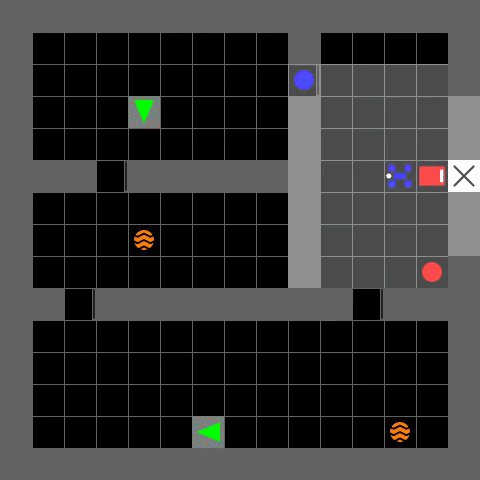
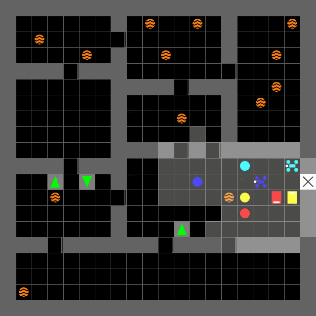
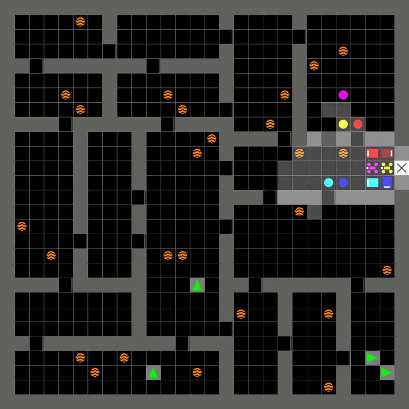

# MACMAT: Memory-augmented Asynchronous Class-based Multi-Agent Transformer

**MACMAT** is a fully mapless, decentralized Multi-Agent Reinforcement Learning (MARL)
framework for robust coordination of heterogeneous robotic teams in highly dynamic
environments. It targets asynchronous decision-making, partial observability, and
intermittent communication **without** maintaining a global map.

MACMAT processes asynchronous high-level waypoints (macro-actions) with continuous-time
liquid memory networks, enabling resilient and scalable multi-robot coordination in
scenarios where a shared occupancy grid is infeasible. It is validated in **MiniSAR**, a
custom 2D grid-world Search-and-Rescue (SAR) environment built on
[MiniGrid](https://minigrid.farama.org/).

> This repository accompanies the manuscript *“MACMAT: Memory-Augmented Class-Based
> Transformer for Generalizable, Mapless Multi-Robot Coordination.”* See
> [Reproducing the paper](#-reproducing-the-paper) for the flags that map to each
> experiment.

---

## 📑 Table of Contents

- [Framework Architecture](#️-framework-architecture)
- [MiniSAR Environment](#-minisar-environment)
- [Installation](#-installation)
- [Repository Structure](#-repository-structure)
- [Usage](#-usage)
- [Configuration Guide](#️-configuration-guide)
- [Reproducing the paper](#-reproducing-the-paper)
- [Citation](#-citation)
- [License & Acknowledgements](#-license--acknowledgements)

---

## 🏗️ Framework Architecture

MACMAT follows **Centralized Training with Decentralized Execution (CTDE)**. Each agent
runs a modular onboard pipeline of three components:

1. **Spatial Awareness Module** — processes local sensory data and Visual-Inertial
   Odometry (VIO) estimates to maintain state awareness without a global map.
2. **High-Level Decision-Making Module (MACMAT)** — the strategic policy that selects
   asynchronous macro-actions (e.g., *“navigate to relative waypoint X”*).
3. **Low-Level Motion Control Module** — a local planner (A\* over the egocentric
   semantic grid) that turns the macro-action into primitive motor commands.

### The MACMAT core ([`macmat_transformer.py`](hetmarl/algorithms/macmat/algorithm/macmat_transformer.py))

| Stage | What it does |
|-------|--------------|
| **Agent State Encoder** | CNN over the local semantic grid + MLP over the VIO pose + [Set Transformer](hetmarl/algorithms/utils/set_transformer.py) over the (permutation-invariant) target set, fused and passed through a recurrent memory module. |
| **Memory module (RNN)** | Selectable via `rnn_type` (see below). Continuous-time variants consume the elapsed macro-step interval Δt to handle irregular, asynchronous timing. |
| **Context-Aware Belief Generator** | Transformer encoder (graph attention across the communication neighborhood) + autoregressive transformer decoder over already-selected macro-actions. |
| **Class-Specific Action Head** | Separate decision heads per robot class (e.g., Rescuer vs. Scout), so heterogeneous behaviors do not share a single output pathway. |

**Memory variants (`rnn_type`):**

| Value | Description |
|-------|-------------|
| `LSTM` | Discrete-time baseline. |
| `CfC` | Closed-form Continuous-time network (dense). |
| `NCP` | CfC with biologically-inspired **sparse** wiring (NoMotor variant). |
| `MixedCfC` | LSTM + dense CfC hybrid. |
| `MixedNCP` | **Proposed** hybrid: LSTM (long-term gating) + sparse CfC (irregular Δt). |
| `NoRNN` | Memoryless ablation. |

---

## 🎮 MiniSAR Environment

MiniSAR ([`searchandrescue.py`](hetmarl/envs/gridworld/gym_minigrid/envs/searchandrescue.py))
is a search-and-rescue testbed modified from MiniGrid.

- **World:** procedurally generated cluttered rooms, doorways, strict "fog-of-war" local
  visibility, and a fixed deployment base.
- **Agents (`agent_classes_list`):** `0` = Rescuer (reaches targets), `1` = Scout (fast
  explorer), `2` = Cleaner (handles hazards), `10`/`210` = randomly assigned class at
  reset.
- **Dynamics:** static or dynamic targets (`dynamic_targets`) and obstacles
  (`dynamic_obstacles`), optional hazards (`spawn_hazards`).
- **Noise models:** VIO localization drift (`use_localization_noise`), perception noise
  (`use_perception_noise`), SLAM noise (`use_slam_noise`).
- **Communication:** full connectivity (`use_full_comm`) or distance-decayed partial
  connectivity (`use_partial_comm`, `comm_sigma`, `comm_radius`).

### MiniSAR demos

MACMAT-driven heterogeneous teams coordinating in MiniSAR at three grid scales:

<p align="center">
  
  &nbsp;
  
  &nbsp;
  
</p>

<p align="center">
  <sub><strong>15×15</strong> · <strong>20×20</strong> · <strong>28×28</strong></sub>
</p>

---

## 🚀 Installation

Requires **Python 3.9+** (and a CUDA-capable GPU for training; CPU works for small runs).

```bash
conda create -n macmat python=3.9
conda activate macmat

# Install dependencies and put `hetmarl` on the import path (editable install):
pip install -r requirements.txt
pip install -e .
```

> **No-install fallback.** If you prefer not to install the package, add the repository
> root to your `PYTHONPATH` instead of `pip install -e .`:
>
> ```bash
> export PYTHONPATH="$PYTHONPATH:/path/to/MACMAT"
> ```
>
> This is required because `hetmarl` is imported as a namespace package; the entry-point
> scripts (`from hetmarl...`) need the repository root to be importable.

The continuous-time memory modules depend on the
[`ncps`](https://github.com/mlech26l/ncps) library (Neural Circuit Policies / LTC base
classes), which is included in `requirements.txt`.

---

## 📁 Repository Structure

```
hetmarl/
├── algorithms/
│   ├── macmat/algorithm/macmat_transformer.py   # MACMAT policy network (core)
│   ├── amat/algorithm/amat_transformer.py        # AMAT baseline (map-based predecessor)
│   ├── macmat_trainer.py / amat_trainer.py        # PPO training logic
│   ├── transformer_policy.py                      # Policy wrapper (act / evaluate / load)
│   └── utils/
│       ├── set_transformer.py                     # Permutation-invariant target encoder
│       └── torchncp/                              # Vendored CfC / NCP / wired-CfC cells
├── envs/
│   ├── gridworld/GridWorld_Env.py                 # Gym wrapper (obs/action spaces)
│   ├── gridworld/gym_minigrid/envs/searchandrescue.py  # MiniSAR simulator
│   └── gridworld/frontier/                        # Frontier-exploration baselines
├── runner/shared/gridworld_runner.py             # Train / eval / render loops
├── utils/                                         # AsynchControl, buffer, value norm, A*
└── scripts/
    ├── config/hydra_train_config.yaml             # Training config (Hydra)
    ├── config/hydra_render_config.yaml            # Render/eval config (Hydra)
    ├── train/train_gridworld.py                   # Training entry point
    └── render/render_gridworld.py                 # Render/eval entry point
```

---

## 🧑‍💻 Usage

All commands are run from the `hetmarl/scripts/` directory (the Hydra `config_path` is
resolved relative to the entry-point scripts).

### Train

```bash
cd hetmarl/scripts
python train/train_gridworld.py                    # uses config/hydra_train_config.yaml
```

Override any config field on the command line (Hydra syntax):

```bash
python train/train_gridworld.py \
    all_args.rnn_type=MixedNCP \
    all_args.use_classbased_action=true \
    all_args.seed=1
```

Convenience wrapper (single seed, GPU 0):

```bash
cd hetmarl/scripts && sh train_gridworld.sh
```

### Render / Evaluate

Point `model_dir` at a trained checkpoint, then render rollouts (and save GIFs) or run a
full evaluation:

```bash
cd hetmarl/scripts
python render/render_gridworld.py \
    all_args.model_dir=/path/to/checkpoint \
    all_args.use_render=true all_args.save_gifs=true
# or for batch metrics:
python render/render_gridworld.py \
    all_args.model_dir=/path/to/checkpoint \
    all_args.use_eval=true all_args.use_render=false
```

### Outputs

- **Checkpoints / logs:** `hetmarl/scripts/results/<env>/<scenario>/<algorithm>/<experiment>/`
- **Weights & Biases:** enabled with `all_args.use_wandb=true` (set `user_name`/`wandb_name`).
- **GIFs:** written under the run directory when `save_gifs=true`.

---

## ⚙️ Configuration Guide

Key fields in [`hydra_train_config.yaml`](hetmarl/scripts/config/hydra_train_config.yaml) /
[`hydra_render_config.yaml`](hetmarl/scripts/config/hydra_render_config.yaml):

| Field | Meaning |
|-------|---------|
| `algorithm_name` | `macmat` (main), `amat` (map-based baseline), or frontier baselines `ft_rrt` / `ft_nearest` / `ft_apf` / `ft_utility` / `ft_voronoi`. |
| `rnn_type` | Memory module: `LSTM`, `CfC`, `NCP`, `MixedCfC`, `MixedNCP`, `NoRNN`. |
| `use_classbased_action` | `true` → class-specific action heads (**paper's main MACMAT model**); `false` → *NoClass* ablation (single shared head + one-hot class id in the observation). |
| `use_graph_attention` | `true` → sequential decision-making + graph attention; `false` → *NoAttn* ablation (independent local processing). |
| `use_full_comm` / `use_partial_comm` | Communication topology. Partial comm decays with distance via `comm_sigma` and `comm_radius`. |
| `agent_classes_list` | Team composition, e.g. `[0,1,0,1]` = 2 Rescuers + 2 Scouts (2R2S), `[0,0,1,0]` = 3R1S. |
| `dynamic_targets` / `dynamic_obstacles` | Toggle moving targets / obstacles. |
| `use_localization` / `use_localization_noise` | Enable VIO pose observations and Gaussian random-walk drift (`position_drift_rate`, `orientation_drift_rate`). |
| `grid_size`, `num_obstacles`, `max_num_targets` | Environment scale and clutter. |

> **Note on the default config.** The shipped configs set
> `use_classbased_action: false`, which corresponds to the *NoClass* ablation. To train
> the headline MACMAT model from the paper, set `use_classbased_action: true`.

---

## 📊 Reproducing the paper

The communication conditions in the paper map to the following flags
(`algorithm_name=macmat`):

| Condition | Flags |
|-----------|-------|
| **Full Comm** | `use_full_comm=true use_partial_comm=false` |
| **Moderate Loss** | `use_partial_comm=true use_full_comm=false comm_sigma=4 comm_radius=10` |
| **High Loss** | `use_partial_comm=true use_full_comm=false comm_sigma=2 comm_radius=5` |
| **No Comm** | `use_full_comm=false use_partial_comm=false` |
| **No Comm + No Loc.** | as *No Comm*, plus `use_localization=false` |

Memory and ablation variants are selected with `rnn_type` (e.g. `LSTM`, `MixedNCP`,
`NoRNN`), `use_graph_attention` (NoAttn ablation), and `use_classbased_action` (NoClass
ablation). Team composition and map size are set with `agent_classes_list` and
`grid_size` (e.g. 1R1S on 15×15, 4R2S on 28×28).

> Exact numerical reproduction also requires the trained checkpoints used in the paper;
> the flags above configure the matching environment/architecture.

---

## 📝 Citation

If you use this code, please cite the accompanying manuscript:

```bibtex
@article{macmat,
  title   = {MACMAT: Memory-Augmented Class-Based Transformer for
             Generalizable, Mapless Multi-Robot Coordination},
  author  = {Farjadnasab, Milad},
  year    = {2025}
}
```

---

## 📄 License & Acknowledgements

This project builds on several open-source works:

- **MiniGrid / gym-minigrid** — base grid-world environment
  ([`hetmarl/envs/gridworld/LICENSE`](hetmarl/envs/gridworld/LICENSE), Apache-2.0).
- **Neural Circuit Policies (`ncps`)** by Mathias Lechner et al. — CfC / LTC liquid
  networks (Apache-2.0), vendored in [`torchncp/`](hetmarl/algorithms/utils/torchncp/).
- **Set Transformer** by Lee et al. — permutation-invariant set encoding.

Please retain the upstream license headers in the vendored components.
